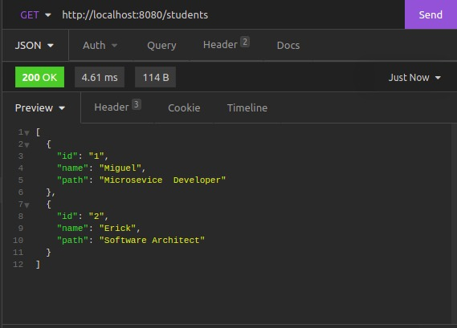
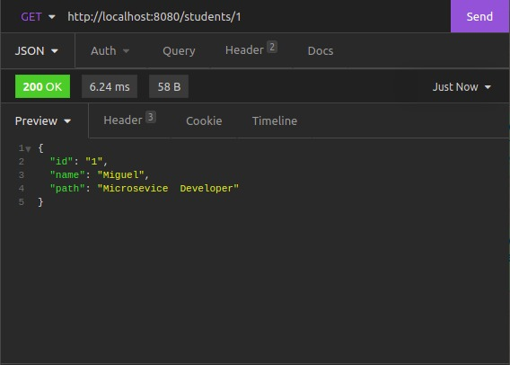

# Breve explicación sobre la inyeccion de dependencias en spring.


Esto es una breve explicación de como funciona y en que consiste el patron Dependency injection(inyección de dependencias)
a partir de un ejercicio muy simple.

### Objetivo del ejercicio 📋
El ejercicio desarrollado es una simple api rest que maneja la información de unos estudiantes.

La api rest consta de 2 Metodos GET los cuales son los siguientes:

- GET : [Host:Puerto]/students/ -> http://localhost:8080/students/
  - Respuesta:
  - 

- GET : [Host:Puerto]/students/[identificador] -> http://localhost:8080/students/1
  - Respuesta:
  
  
***El ejercicio se dividió en 2 carpetas una en donde se muestra de manera sencilla el uso de la inyección de dependencias y otra en donde no se usa.***

_Nota: El ejercicio en ambas carpetas tiene la misma estructura y misma funcionalidad como la que se mostro anteriormente._

## Explicacion del ejercicio:
Específicamente la manera en la que se ejemplifica la inyección de dependencias en el ejercicio se puede ver a mas detalle en los siguientes archivos:

**Inyeccion de dependencias, Haciendo uso de la anotacion @Autowired que spring proporciona para este fin.**
#### /src/main/java/com/in28minutes/rest/webservices/restfulwebservices/user/User.java
```java
public class StudentController {
    
//Uso de la inyeccion de dependencias
  @Autowired
  private StudentService studentService;

  /**
   * Metodo que maneja una peticion GET
   * Regresa una lista de estudiantes
   * @return Student el estudiante que fue encontrado.
   */
  @GetMapping("/students")
  public List<Student> getStudents(){
    return studentService.getStudents();
  }

  /**
   * Metodo que maneja una peticion GET
   * Regresa a un estudiante en particular
   * @param  studentId identificador del student a buscar
   * @return Student el estudiante que fue encontrado.
   */
  @GetMapping("/students/{studentId}")
  public Student getStudent(@PathVariable String studentId){
    return studentService.getStudent(studentId);
  }

}

```

**Inyeccion de dependencias manual**

#### /src/main/java/com/in28minutes/rest/webservices/restfulwebservices/user/User.java

```java
public class StudentController {

  //Inyeccion de dependencias manual
  private StudentService studentService;
  
  public StudentController() {
    studentService= new StudentService();
  }

  /**
   * Metodo que maneja una peticion GET
   * Regresa una lista de estudiantes
   * @return Student el estudiante que fue encontrado.
   */
  @GetMapping("/students")
  public List<Student> getStudents(){
    return studentService.getStudents();
  }

  /**
   * Metodo que maneja una peticion GET
   * Regresa a un estudiante en particular
   * @param  studentId identificador del student a buscar
   * @return Student el estudiante que fue encontrado.
   */
  @GetMapping("/students/{studentId}")
  public Student getStudent(@PathVariable String studentId){
    return studentService.getStudent(studentId);
  }

}

```
##Comparación

De lo anterior nos podemos fijar exclusivamente en los siguientes fragmentos de código de ambos archivos.

#### /src/main/java/com/in28minutes/rest/webservices/restfulwebservices/user/User.java
```java

//Uso de la inyeccion de dependencias
  @Autowired
  private StudentService studentService;

```


#### /src/main/java/com/in28minutes/rest/webservices/restfulwebservices/user/User.java
```java
  //Inyeccion de dependencias manual
private StudentService studentService;

public StudentController() {
        studentService= new StudentService();
        }

```

Al comparar el código que hace uso de la inyección de dependencias contra el que no, podemos notar que el que si hace uso de esta
le delegamos la tarea de crear y suministrar objetos de la clase **StudentService** a **Spring**(apegandonos asi al patron IOC(inversion de control)). En lugar de que sea la propia clase **StudentController** la que cree dichos objetos, tal y como se puede apreciar en el segundo ejemplo en donde la clase **StudentController** es la que crea el objeto,
